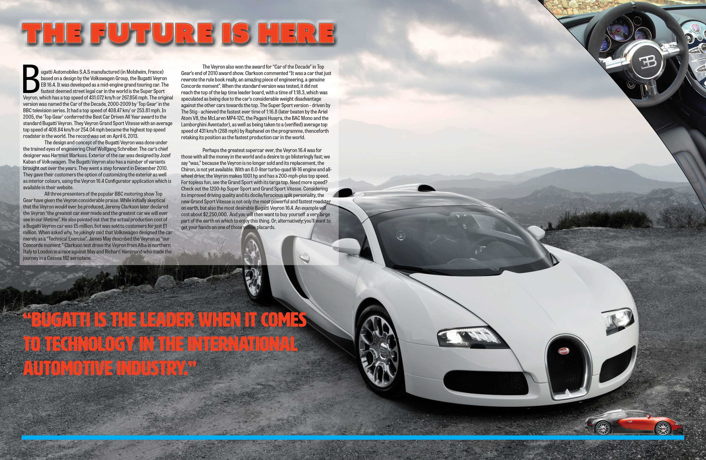
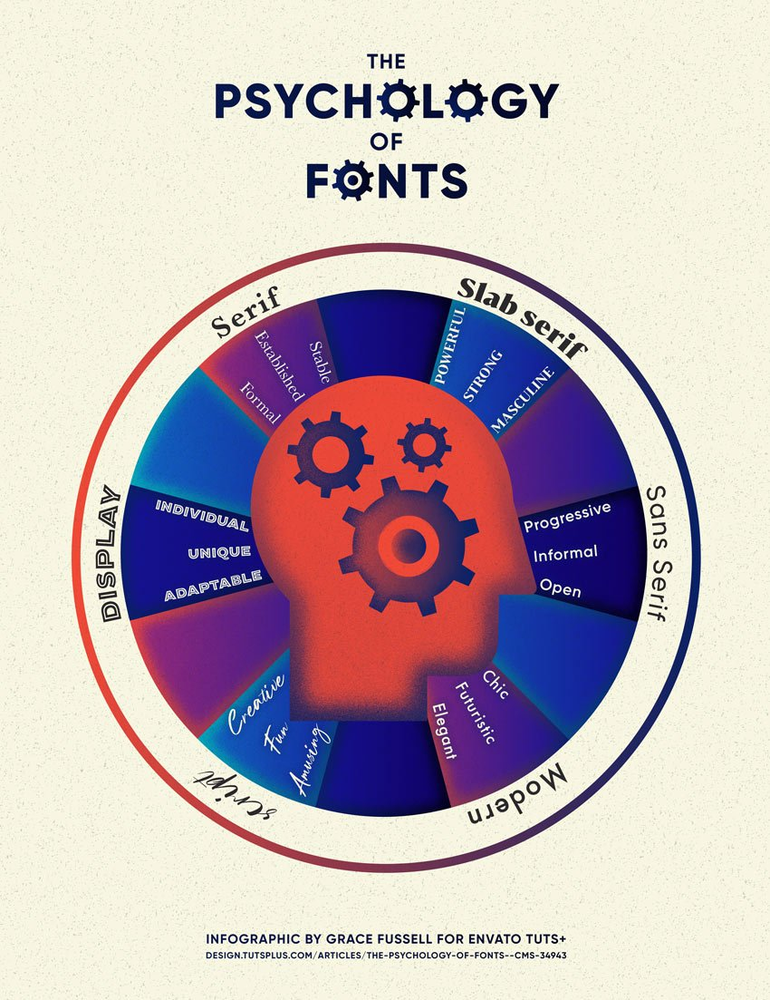
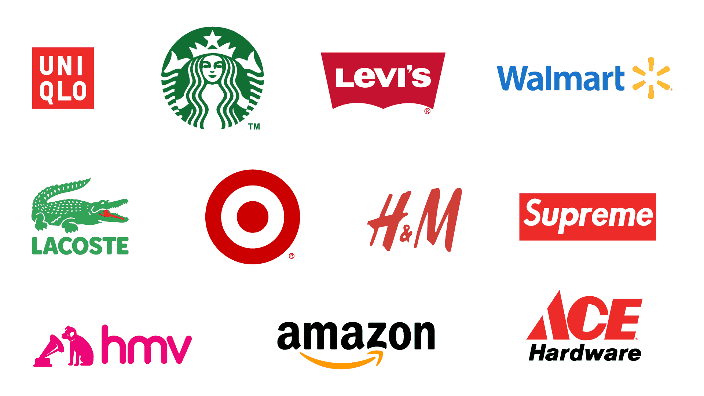
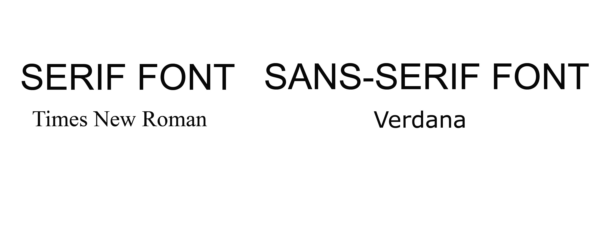
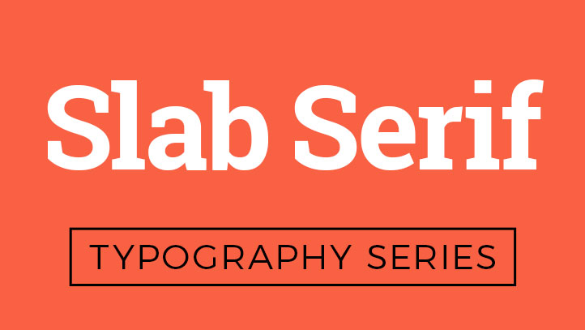
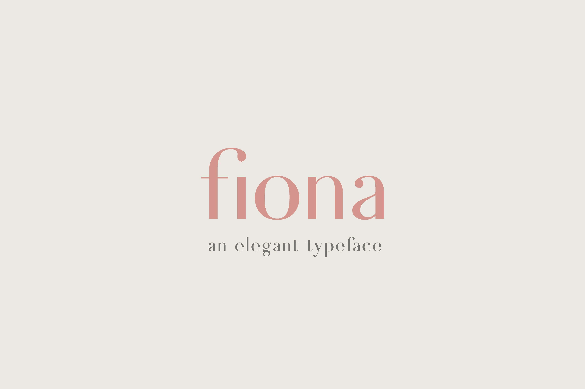
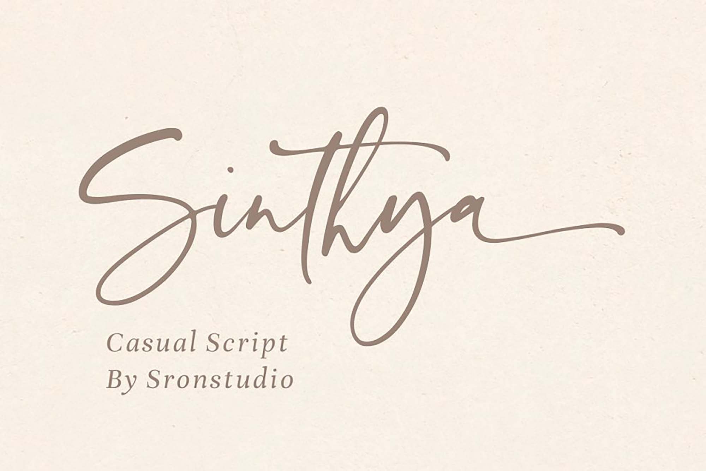

For years designers have had many tools to provoke the mind of viewers. One of these tools being fonts. However the use of fonts, branding and logos to create emotional responses has only been fully realised in the past few decades. These uses of fonts are often used to create brand identities. A good example of this is the Top Gear magazine, DixonBaxi developed the typeface known as TG industry. This gives the brand a consistent presence across all its media platforms. 

So what is the psychology of fonts? Essentially humans love to apply human characteristics to objects, and non human entities, this is known as anthropomorphism. Due to humans' emotional response to visuals, designers can manipulate these psychological responses the viewers have, this is done through the use of fonts and colour. Due to humans having higher engagement with visual content than written content, this is referred to as picture superiority effect by psychologists. This means the font and visuals on a brand's logos are more memorable than the written content.

In order to make an audience respond to a brand the designer can not only change the text appearance but also the font design, various fonts can be used for emotional effect or a more powerful effect. A good example would be if a business wants to come across as stable and formal, they could use a traditional serif font, while a company who wants to appear innovative and forward thinking can use a more futuristic sans font.

However a more psychological approach can be taken, with the combination of various emotional impacts. This includes the change of colour or size, or even outline. These techniques can be used to display multiple moods.

When talking about font design there are usually six major groups. These are Serifs, Slab Serifs, Sans Serifs, modern sans serifs, scripts and display.  

1. Serifs 

Serifs are known to be a trustworthy font. They have a psychological association with tradition, stability, and intellect. 

Serif first appeared in the early 1800s, this rich history creates a sense of tradition and establishment for the viewer. 

Good examples of serif logo designs are HSBC and Vogue.

2. Slab Serifs.

Slab Serifs are known to be powerful fonts. They have an impact on the reader coming across as strong and masculine. They are often used more by electronic companies and car manufacturers. This is to communicate a sense of power with the viewer.

Good examples of companies to use these are Volvo and Sony. 

3. Sans Serifs.

Sans Serifs come across as open, informal, progressive and friendly. This group of fonts refers to those without serifs. Serifs are the small strokes attached to the end of the letterforms. Sans serif tends to come across as progressive and emotional, this is why tech companies and social media sites tend to use them.

Good company examples are Nike, Apple and FedEx.

4. Modern Sans Serifs

This group of fonts comes across as Elegant and Futuristic. This group is often used by companies such as furniture retailers and fashion brands. This is because the psychological impact on the reader is that of modernism and design, with elegance. Modern sans serif tends to feature rounded letterforms, giving them an open appearance.

Good examples of brands who use this are Google, Chanel and Airbnb.

5. Scripts.

Script fonts are known to be fun, amusing, romantic and childlike. Scripts also fall in the same category as handwritten fonts. These fonts have been inspired by the traditional method of handwriting. These leave the reader with a feeling of sophistication, this is why this style is often used in high end restaurants. 

Good examples of brands using this font group are Kelloggs, Disney and Budwiser.

6. Display

 This group of fonts are for those you can't quite place in other categories. These come across as unique and adaptable. These are usually used by playful brands, as well as for novelty.

Good examples of brands who use this are Lego, MTV and Greenpeace.