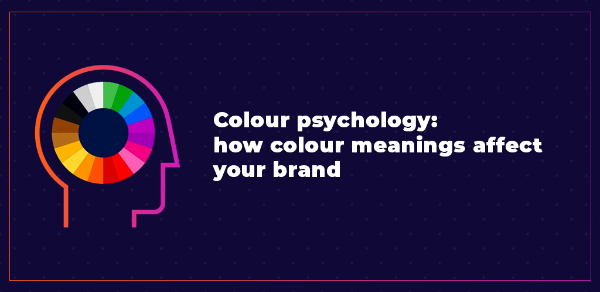
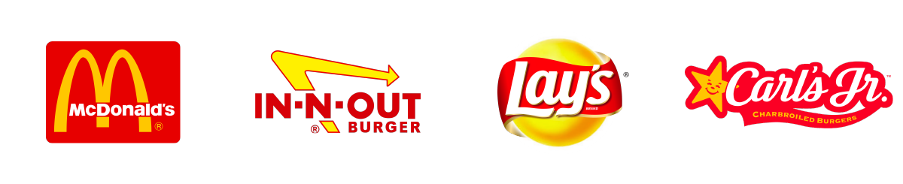
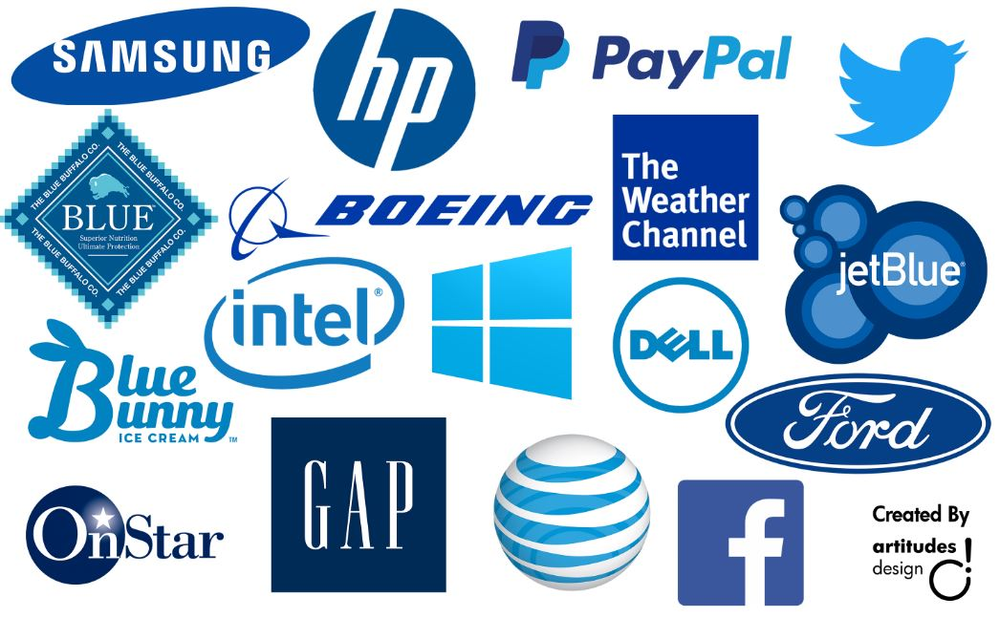

Firstly, we need to explain what colour psychology is. Colour psychology is the study of colour and its relation to human behaviour. Colour influences people's perceptions in a subtle way. These colours can cause certain emotions in people. Colour psychology is also widely used in branding and marketing. Colour is important in marketing and branding as these various colours influence consumers emotions and perceptions about goods and services.

 

The first example is the colours used by many fast-food restaurants. The combination of red and yellow can stimulate hunger. This is why companies such as McDonalds, Burger King, and In-N-Out Burger use these colours in their branding. This phenomenon is known as the ketchup and mustard theory. 

 

The reason this works is due to the effects of both colours combining. Yellow is associated with feelings of contentment, comfort, competence and happiness. This colour leaves viewers with a feeling of friendliness and nostalgia. This is why McDonalds use the golden arches. Meanwhile Red is associated with power, and love. Not only do these colour combinations represent the condiments often used in fast food, but also warm feeling and satisfaction we get when eating with friends and family. This is why this colour combination makes us hungry and craving food to eat.

 

Although not all food retailers use this theory, yellow is also often paired with green. This is often used by brands who want to appear healthier. The colour green represents growth, renewal, health and life. This is why Subway use these colour combinations. This is a branding attempt to influence the viewer into being hungry but choosing a healthy alternative. 

 

Another example is the colour blue. Blue has many impacts on readers, and many connotations linked in colour theory. Firstly, the colour blue is associated with water, hence why most water brands use blue labels on their bottle, it influences the consumer to see it as pure and clean. This is why companies such as Nivea, and Oral-B use the colour blue, as it gives a medical feel and a feeling of cleanliness.

 

Blue is also a very likable colour hence its vast use in social media platforms such as Facebook, Twitter and LinkedIn. 

 

Blue has also become a very safe choice for its use in business branding. This is why many companies such as IBM, Unilever and SAP use the colour blue in its branding. Blue is often used due to its feelings of stability and reliability.

 

These two examples are a great explanation to why colour is so important in branding and with the pairing of font. This is why marketers focus a lot on colour in branding.