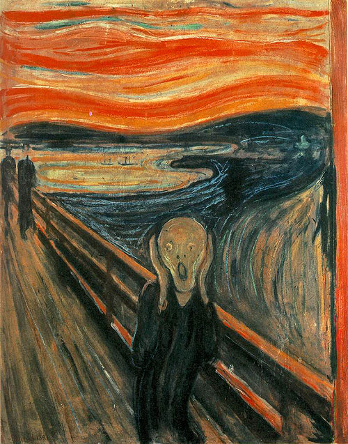
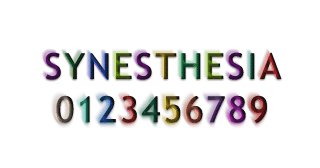

So, what is Synaesthesia? It essentially is when someone hears music, but sees shapes. So, it creates associations between senses that normally would not be a thing. For example, people can associate colours with names, numbers and genders. For example, the colour pink may be a man named ‘Luke,’ or you may write the word ‘road’ and it tastes like bitter chocolate. 

 

The word ‘synaesthesia’ can be translated from its ancient Greek roots. It translates to ‘perceive together.’ The most common feature is to see letters, numbers, or sounds as colours. However, people can also see shapes and taste food.

 

In this article I'm going to link this phenomenon with typography. Designers have already started to adopt an approach similar to what synesthetes experience. This includes not only the use of fonts, but also the use of colour, texture and shapes. This process can be called ‘Cross-sensory typography.’ This process of seeing type through a computational lens can be described by using synaesthesia as the metaphor. So, the future of typographic design will employ the use of Synaesthesia. Synaesthesia is seven times more common among artists, novelists and poets, and creative people in general. Synaesthesia is for sure a thing of the future. The use of all the senses together helps with experiencing reality in as many forms as possible. 

 

From about 1900-1950 the use of Synaesthesia was used in the creation of art. A good example of this is Edvard Munch’s painting ‘The Scream’ In this image the visuals are like hearing a silent, inner scream. This use of visuals to trigger sound can be used in typography. This could be very useful when music companies would want the perfect typographic design for their brand, as visuals that evoke sound would be perfect for brands dealing with sound.

 

Another important aspect in type is the use of colour. Grapheme-colour synaesthesia affects an individual’s perception of numbers and letters in association with the experience of colour. One study found it can be traced back to people using coloured fridge magnets. This shows with certain uses of typography, people can be influenced psychologically, even in the future.

 

To sum up, the use of synaesthesia is great when it comes to developing the use of typography to influence readers' minds. However, the main crux to this is how to discover which type of colours or shapes influence the largest majority of people, however this could be used to target very specific target audiences. This would need vast research into many individuals from all walks of life, there could be a possible correlation to what sounds or colours people experience, based on their lives and upbringing, essentially allowing designers to use nostalgia as a marketing tool.