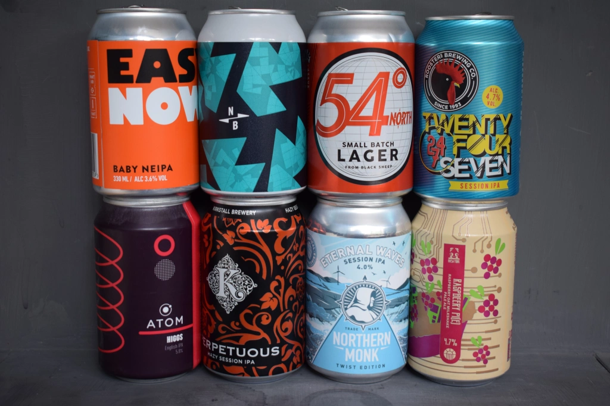
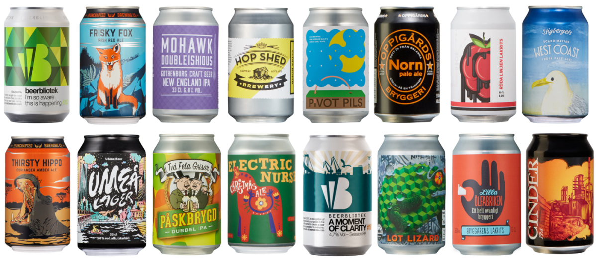
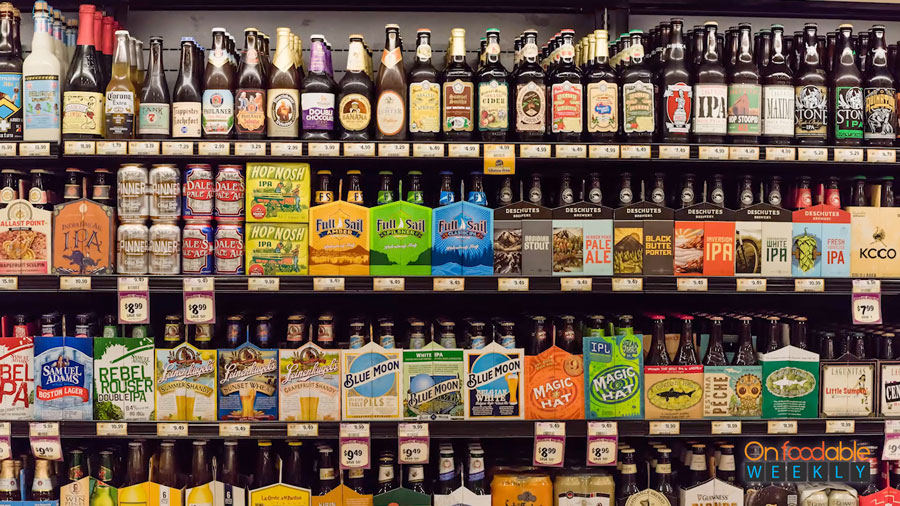
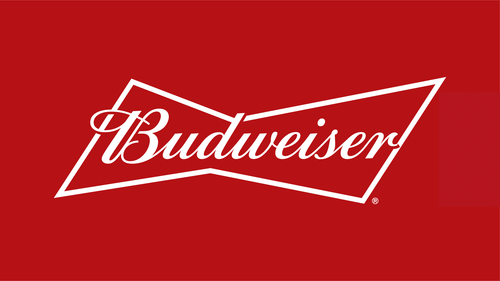

The way beer brands use typography to impact their costumers has changed in recent years. As consumers we are used to the traditional branding, such as Budweiser and Heineken, these are often brought due to preference and their renowned traditional flavour. 

 

However, with the rise in micro brewing plenty of new alternatives have hit the market. To put this in perspective: Ten years ago, the United States had 1,650 registered craft breweries; today there are more than 7,300, and that number is only going to grow. This is good news for beer lovers, but bad news for indecisive drinkers who make decisions based on whatever looks cool. These brands don’t have the same tradition as the original brands. So, in order to compete many companies have been using typography to psychologically impact the consumer. Traditionally many beers would look similar in terms of font and colour. These new brands like to use abstract colourful designs, often with a sans-serif logo. 

 

The use of vivid colour and abstract images is a great way to sell more beer. This is because people have started looking for the coolest looking cans, that also display the kind of beer it is. Often brands will use colours based on the flavour of the beer, for example a beer with a more orange/citric flavour will use colours such as orange and yellow, while a stout for example would use browns and greys. The use of these colours can sway drinkers away from the traditional brands, this is because the colours often give consumers a mental ‘preview’ of the kind of beer they would be drinking. 

 

The newer beer companies have started to use san-serif fonts, this impacts the consumer due to the font design coming across as open, informal, progressive and friendly. Designers use the type face to portray the beer as cool, new and a great casual drink. This is opposite to the traditional brands such as Budweiser, who use script type face. These fonts have been inspired by the traditional method of handwriting. These leave the reader with a feeling of sophistication. 

In conclusion, the way typography is used in the beer industry is changing. This is to allow for new companies to compete with the huge brands. The use of bright colours, and san-serif fonts physiologically impacts the consumer in a way that leaves them wanting to try something new, go against the traditional choices.  

