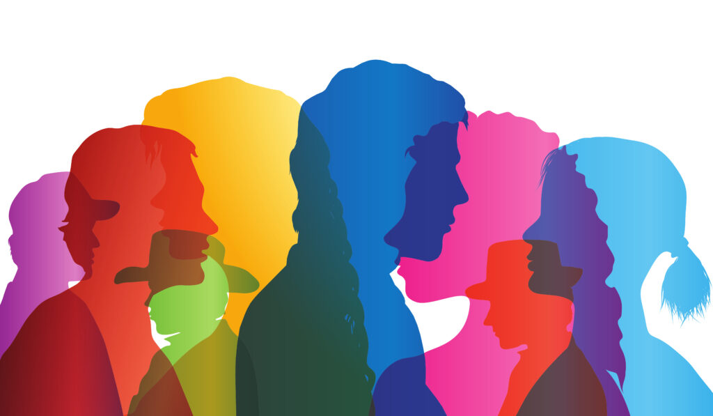
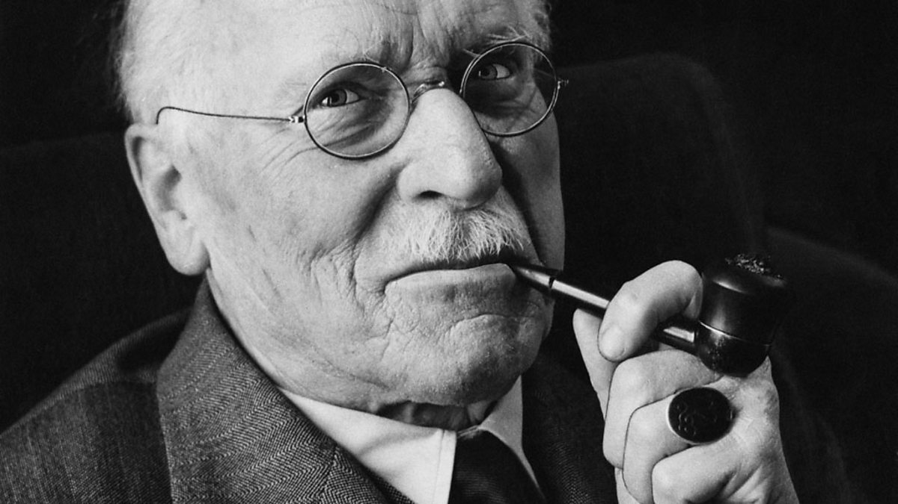
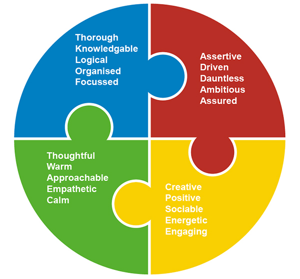
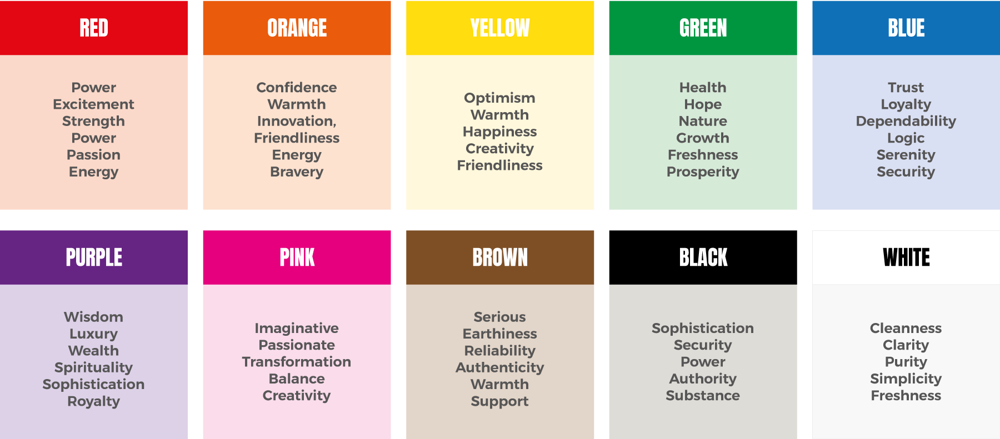

The use of fonts and colour are key to the overall branding of a product and its marketing. These methods can help convey emotion, and give your brand a personality, and display company values.

Various studies have shown around 93% of consumers rely on visual appearance when browsing for a product. Also, 85% of consumers say colour is the primary reason they brought a product, with 90% claiming they made impulse purchases based on colour alone. This is astounding, considering the subconscious nature involved in colour psychology.

It is believed that the impact of colour psychology has been hardwired in humans for thousands of years. This is because our ancestors would have used colour to determine what foods are safe, as well as what predators need to be avoided, based on their colours.

The work of Carl Jung is arguably one of the most famous studies into colour psychology. The idea is that there are four colour temperaments. 

These being

Cool Blue: Shows no bias, objective, detached, analytical, melancholic.

Earth Green: Still, tranquil, calming, soothing, Phlegmatic

Sunshine Yellow: Cheerful, uplifting, spirited, enthusiastic, sanguine

Fiery Red: Positive, decisive, bold, assertive, choleric

However, this theory has now been developed with colours having different moods associated with them. Here are a few examples.

* Red: excitement, love, strength, energy, passion, anger, danger, lust, endurance, aggression, pain
* Blue: trust, competence, peace, loyalty, intellect, security, masculinity, depression, fear, coldness
* Yellow: cheer, light, happiness, energy, creativity, good times, jealousy, instability
* Green: quality, nature, healing, freshness, growth, money/wealth, envy, guilt
* Orange: confidence, success, sociability, bravery, friendliness, outdatedness
* Pink: sincerity, sophistication, sweetness, compassion, playfulness, femininity, immaturity, weakness
* Purple: ambition, spirituality, royalty, luxury, faith, moodiness, fantasy, mystery
* Black: dramatic, class, formality, security, grief, sophistication, grief, fear
* White/Silver: cleanliness, purity, innocence, simplicity, pristine, sterile, empty, cautious, distance
* Brown: austerity, outdoors, longevity, friendliness, ruggedness

Max Lüscher, on the other hand, developed the Lüscher color test, where participants can build a color chain depending on their personal preference, and this can be used to determine their mental state and predict emotions from their reactions to one or another colour.

Not only is colour important but so is the overall layout of a product, psychologist Kevin Larson researched the way consumers find reading a lot quicker and enjoyable when the image placement, colour, layout and font are all designed well. Combining these together can be a great tool for a designer. They will impact the consumer in a way that brings more attention to the product, and creates an association with the brand.