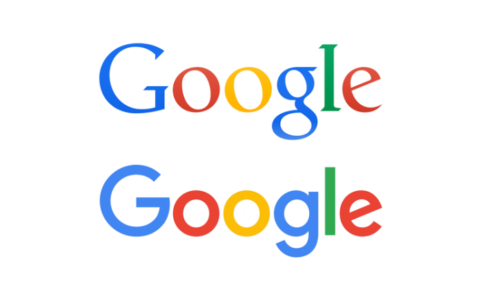
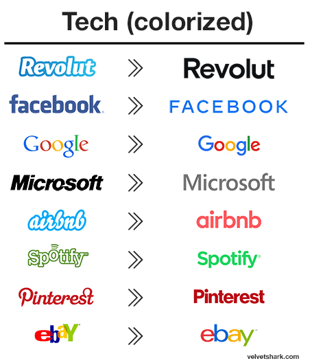

Many companies have changed their branding over the years, this involves a change in the typeface used by designers. 

Back in 2015 Google decided to redesign its logo, this was their biggest logo redesign since 1999. The logo prior to the change used a serif typeface, this means the letter had “little tails” this typeface gives the reader an impression of tradition and stability. However, Google wanted a brand change. Google decided to use the typeface Product Sans, this makes the logo appear, “simple, uncluttered, colourful and friendly.”  In an official blog post, it suggests it was looking to retain a "simple, friendly and approachable style". The new typeface is easily scalable. "Google is one of the world's most innovative companies, so the previous serif wordmark was never really the right fit, particularly considering the young age of the business. Serif typefaces are generally more suited to traditional companies with a lot of history and heritage. It makes sense for Google to be identified by a more contemporary mark."

Companies change their typeface to stay up to date, or because the old design doesn't fit the new business strategy. Designers use these changes to impact the consumer in a way that promotes the brand's identity.                   

There is a trend in logo design that started around 2017-2018. It’s as if many companies decided that being unique wasn’t the norm, so many companies changed their typeface.

The trend started with fashion logos. Many iconic fashion companies ditched their recognizable logos and switched to a bland and very similar version of a sans serif font.

The technology sector followed soon after.

So what are the reasons for this?

Branding specialists point to the practical benefits of what they call the ‘modern utility’ of sans serif typefaces. Cleaner and more legible, they are better suited to a variety of media and work particularly well online. The purity of these fonts allows the brands to be an empty vessel, ready to accommodate rapidly shifting trends.

Another reason cited by brand specialists is that it’s a natural step for brands to take as they grow from scrappy startups into established brands. The goals have shifted from making noise and standing out to being a trusted, dependable part of people’s everyday lives.

People at the head of these powerful brands know that they are not defined by their logo anymore but by the product or service they provide. They are strong thanks to what they allow you to do with them.